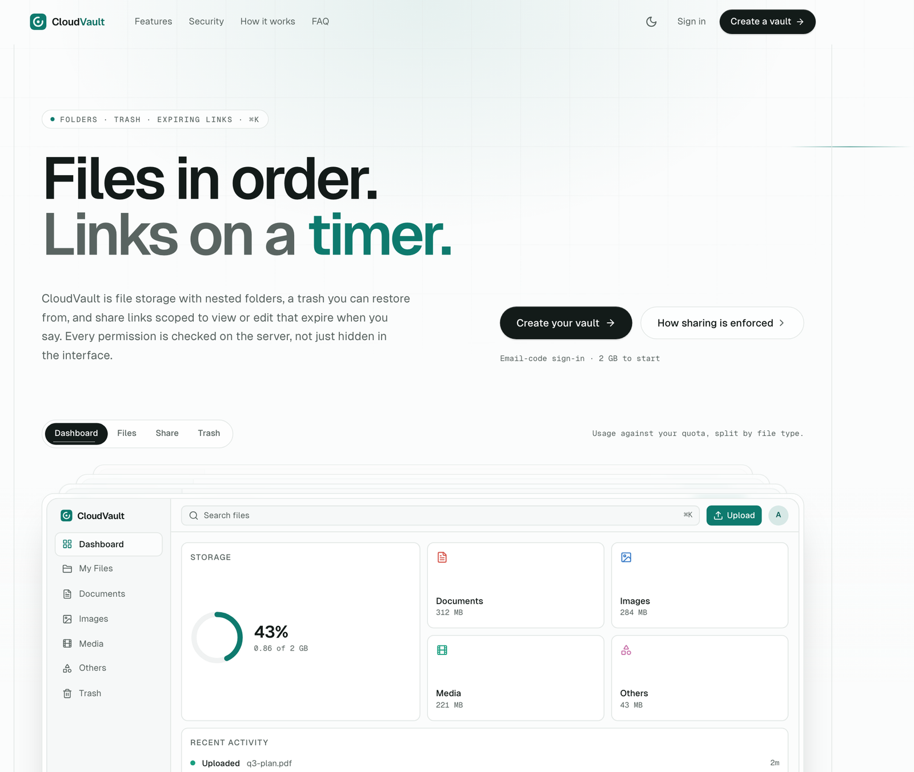

<div align="center">
  <br />
  
  <br /><br />

  
  
  
  
  
  
  

  <h3>File storage with nested folders, a restorable trash, and share links that expire.</h3>

  <a href="https://cloud-vault-theta.vercel.app/"><strong>Live demo →</strong></a>
</div>

## Contents

1. [Overview](#overview)
2. [Features](#features)
3. [How permissions work](#how-permissions-work)
4. [Tech stack](#tech-stack)
5. [Project structure](#project-structure)
6. [Quick start](#quick-start)
7. [Testing](#testing)
8. [Deployment](#deployment)
9. [Known limitations](#known-limitations)

## Overview

CloudVault is a Drive-style file manager built on the Next.js 15 App Router and Appwrite. You sign in with an email code, upload files into nested folders, preview them in the browser, and share them — with specific people as viewers or editors, or with anyone who has a link that expires when you choose.

Every permission is enforced on the server. The UI hides what you can't do, but the server re-checks ownership and share roles before every mutation, so a crafted request can't touch a file you don't have access to.

It started as a course project and was rebuilt end to end: a security fix for the permission model, a real sharing system, trash, quotas, previews, an activity log, a full redesign, and a unit + end-to-end test suite.

## Features

**Files and folders**
- Nested folders with breadcrumbs, move-to-folder, and folder-aware uploads
- Drag-and-drop uploads anywhere in the window, with a Drive-style upload tray (progress, cancel, retry)
- List view with sortable columns and a right-click menu; grid view with real thumbnails
- Multi-select with checkboxes, shift-click ranges, ⌘/Ctrl-click and ⌘A, plus a floating toolbar for move, zip download and trash
- Undo on destructive actions

**Trash**
- Delete is a soft delete — items go to `/trash` and can be restored
- Trashing a folder cascades to its contents; permanent delete is a separate, explicit action

**Sharing**
- Invite people by email as **viewers** or **editors**, change or remove their access later
- "Anyone with the link" sharing with a view/edit role and an expiry of 1 day, 7 days, 30 days, a custom date, or never
- Links can be revoked; expired or revoked links stop working immediately
- Public `/share/[token]` page that works without signing in

**Previews**
- Full-screen previewer with prev/next and keyboard arrows
- Images (with zoom and pan), video, audio and PDF (paged), plus a details/activity side panel
- Server-generated 256px WebP thumbnails for images (via `sharp`)

**Workspace**
- Dashboard with storage used vs. quota (split by documents, images, media, others), recent files and recent activity
- **Enforced storage quota** — uploads that would exceed it are rejected on the server (2 GB default, 50 MB per file)
- Fulltext, paginated search
- **Activity log** — uploads, renames, moves, trash/restore, permanent deletes, folder creation, shares and unshares
- **⌘K command palette** for search, navigation and actions; keyboard shortcuts throughout
- Light and dark themes, responsive down to mobile, reduced-motion support

**Admin**
- Admins can view all files and manage users: usage vs. quota per user, and disable/enable accounts (disabled users can't sign in)

## How permissions work

All file mutations run as Next.js Server Actions using an Appwrite API key, which bypasses Appwrite's own document permissions. So the server is the single source of truth for access:

- `lib/permissions.ts` holds small **pure functions** — `canRead`, `canWrite`, `canShare` — that take a file, the caller and their share grants and return a decision. No network calls, so they are unit-tested exhaustively.
- Every action (rename, move, trash, restore, delete, share) loads the file, resolves the caller's role (owner, editor, viewer, link holder, or none) and calls the right check **before** writing anything.
- Shares live in their own `shares` collection (`fileId`, `granteeEmail` or `token`, `role`, `expiresAt`), so a share is a row you can reason about, revoke and test.
- Owner identity on upload comes from the session, never from a client-supplied field.

## Tech stack

- **Next.js 15** (App Router, Server Actions, Route Handlers) and **React 19**
- **TypeScript** in strict mode, with type and lint errors failing the build
- **Appwrite** — auth (email OTP), database, storage
- **Tailwind CSS** with a custom token system, **Radix UI** primitives, `cmdk`, `pdfjs-dist`, `jszip`, `sharp`
- **zod** for environment and input validation
- **Vitest** (unit) and **Playwright** (end-to-end)
- **ESLint**, **Prettier** and **Husky** pre-commit hooks

## Project structure

```
app/
  page.tsx                 marketing landing page
  (auth)/                  sign-in, sign-up (email OTP)
  (root)/                  authenticated app: dashboard, files, [type], trash, admin/users
  share/[token]/           public share-link page
  api/files/[id]/          file content, thumbnails, shares (route handlers)
components/                UI — shell, file browser, upload tray, previewer, share dialog, ui/ primitives
lib/
  actions/                 Server Actions (files, shares, users, admin)
  server/                  server-only helpers: access checks, pagination, activity log
  permissions.ts           pure permission logic (+ tests)
  quota.ts, folders.ts, preview.ts   pure logic (+ tests)
  appwrite/                Appwrite clients and validated config
scripts/setup-schema.mjs   idempotent Appwrite schema setup
e2e/                       Playwright suite
```

## Quick start

**Prerequisites:** Node.js 24, npm, and an [Appwrite](https://appwrite.io/) project (Cloud or self-hosted) with one database, one storage bucket, and `users` and `files` collections.

```bash
git clone https://github.com/ayush09316/CloudVault.git
cd CloudVault
npm install
```

Create `.env.local` in the project root:

```env
NEXT_PUBLIC_APPWRITE_ENDPOINT="https://cloud.appwrite.io/v1"
NEXT_PUBLIC_APPWRITE_PROJECT=""
NEXT_PUBLIC_APPWRITE_DATABASE=""
NEXT_PUBLIC_APPWRITE_USERS_COLLECTION=""
NEXT_PUBLIC_APPWRITE_FILES_COLLECTION=""
NEXT_PUBLIC_APPWRITE_BUCKET=""
NEXT_PUBLIC_APPWRITE_SHARES_COLLECTION="shares"
NEXT_PUBLIC_APPWRITE_ACTIVITY_COLLECTION="activity"
NEXT_APPWRITE_KEY=""
```

`NEXT_APPWRITE_KEY` is a server-only Appwrite API key — never expose it with a `NEXT_PUBLIC_` prefix.

Create the attributes, indexes and collections the app needs (safe to re-run — it skips anything that already exists):

```bash
node scripts/setup-schema.mjs
```

This adds folders (`isFolder`, `parentId`), trash (`deletedAt`), thumbnails, a fulltext index on file names, per-user `quotaBytes` and `disabled`, and the `shares` and `activity` collections.

Run the app:

```bash
npm run dev
```

Open [http://localhost:3000](http://localhost:3000).

## Testing

```bash
npm run test       # Vitest — permission, quota, folder-path and preview logic
npm run test:e2e   # Playwright — real flows against your Appwrite project
npm run lint
npm run build
```

The end-to-end suite starts its own server on port 3456, creates a throwaway user, and deletes everything it created when it finishes. It covers:

- signing in with an email code
- uploading into a nested folder and generating a thumbnail
- trashing a file and restoring it
- opening a share link without signing in, then revoking it
- bulk-selecting files and moving them to trash

## Deployment

The live app deploys on **Vercel** from `main` (Node 24, pinned via `engines` in `package.json`). GitHub Actions runs lint and a production build on every push.

Set the same environment variables in your Vercel project. `NEXT_APPWRITE_KEY` should be marked **Sensitive**; the `NEXT_PUBLIC_*` IDs are public by design.

The repo also contains a Dockerfile (`output: "standalone"`) and Kubernetes manifests in `k8s/` from an earlier experiment. They aren't part of the live deployment path.

## Known limitations

- **Upload progress is estimated**, not byte-accurate, because uploads go through Server Actions, which don't report progress and run one at a time per page. Moving uploads to a dedicated route would fix both.
- **Search** uses Appwrite's fulltext index, which matches whole words and prefixes rather than arbitrary substrings.
- **Thumbnails share the main storage bucket** (the Appwrite free plan caps the number of buckets) and don't count toward the quota.
- Appwrite-level collection and bucket permissions are open; access control lives in the app layer described above.
